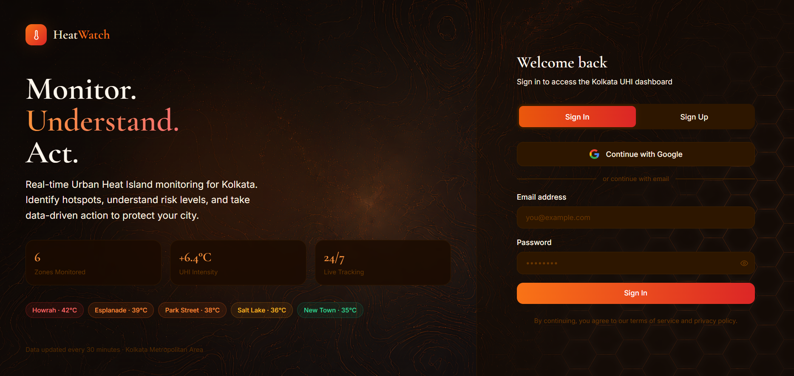
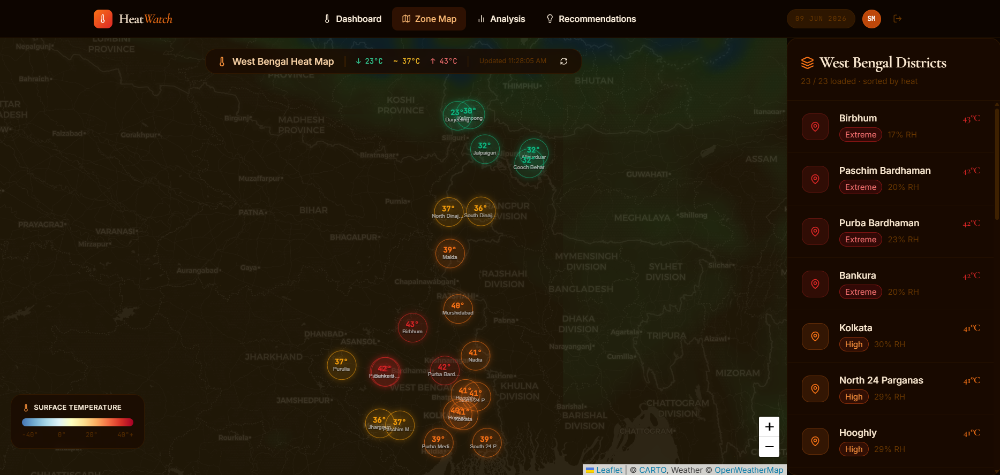
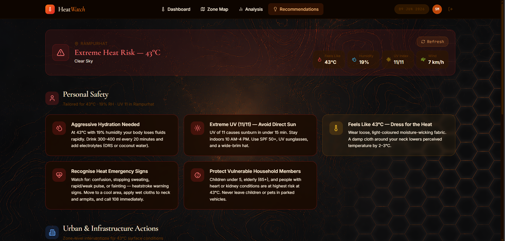
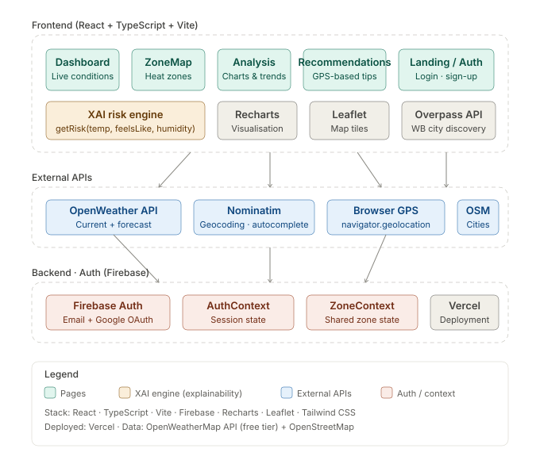
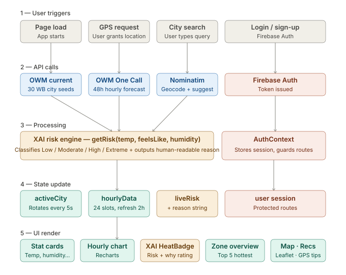

# 🌡️ HeatWatch — Urban Heat Island Monitor

HeatWatch is a real-time Urban Heat Island (UHI) monitoring dashboard for West Bengal, India. It collects live meteorological data from 30+ cities via the OpenWeather API, classifies heat risk using a transparent Explainable AI (XAI) engine, and delivers actionable recommendations based on the user's GPS location — helping individuals and communities prepare for extreme heat events before they become public health emergencies.

Built as part of the **SAAYA Internship Program – Technical Assignment (Round 2)** by Harit Vikas Technologies Pvt. Ltd.

> **Live Demo:** [heatwatch.vercel.app](https://heatwatch.vercel.app) &nbsp;|&nbsp; **GitHub:** [github.com/S0hini/HeatWatch](https://github.com/S0hini/HeatWatch)

---

## 📸 Screenshots

> _Add screenshots of your deployed app below. Recommended: Landing page, Dashboard, ZoneMap, Analysis, Recommendations._

| Landing & Auth | Dashboard |
|---|---|
|  |  |

| Zone Map | Analysis |
|---|---|
|  |  |

| Recommendations | XAI Risk Badge |
|---|---|
|  |  |

---

## ✨ Key Features

- **Live weather data** for 30+ West Bengal cities via OpenWeather API, auto-rotating every 5 seconds
- **XAI risk engine** — classifies heat risk (Low / Moderate / High / Extreme) and explains *why* in plain language using temperature, humidity, and feels-like delta
- **GPS-based recommendations** — detects the user's location and provides personalised cooling tips and nearest cooling centres via Overpass API
- **Hourly forecast chart** — 24-hour temperature and feels-like trend using OpenWeather One Call API
- **Interactive zone map** — Leaflet-powered geospatial heat zone visualisation across Kolkata's districts
- **Multi-city analysis** — compare weather metrics across cities with bar charts, radar charts, and heat index tables
- **Historical trend data** — UHI intensity trends from 2000–2026
- **Firebase Authentication** — email/password and Google OAuth (Bonus Challenge)
- **City search with autocomplete** — Nominatim-powered typeahead for any Indian city

---

## 🧠 Explainable AI (XAI)

HeatWatch implements a transparent risk classification engine (`getRisk`) that surfaces its decision logic directly to the user. Rather than displaying a risk badge alone, the dashboard shows a **"Why this rating"** panel listing every factor that contributed to the classification:

```
🔴 EXTREME
Why this rating:
• Temp 42°C ≥ 42°C (Extreme threshold)
• Humidity 68% — high, amplifies heat stress significantly
• Feels like 49°C (+7°C above actual — humidity effect)
```

This directly addresses the XAI principles of **transparency** and **explainability** discussed in the theoretical section — the model's reasoning is visible, auditable, and human-readable at every step.

---

## 🏗️ System Architecture



### Layers

| Layer | Components |
|---|---|
| **Frontend** | React · TypeScript · Vite · Tailwind CSS · React Router |
| **XAI Engine** | `getRisk(temp, feelsLike, humidity)` — transparent risk classifier |
| **Visualisation** | Recharts (charts) · Leaflet (maps) |
| **External APIs** | OpenWeather API · Nominatim · Browser GPS · Overpass (OSM) |
| **Auth / State** | Firebase Auth · AuthContext · ZoneContext |
| **Deployment** | Vercel |

---

## 🔄 Data Flow



1. **User trigger** — page load, GPS grant, city search, or login
2. **API call** — OpenWeather fetches live conditions; Nominatim geocodes; Firebase issues auth token
3. **XAI processing** — `getRisk()` classifies risk level and generates a human-readable reason string
4. **State update** — React state stores `activeCity`, `hourlyData`, `liveRisk`, `reason`, and `userSession`
5. **UI render** — stat cards, hourly chart, XAI HeatBadge, zone overview, and map update reactively

---

## 🛠️ Technology Stack

### Frontend
- React 18 · TypeScript · Vite
- React Router DOM
- Tailwind CSS

### Data & APIs
- OpenWeather API 2.5 / 3.0 (current weather + One Call hourly forecast)
- Nominatim / OpenStreetMap (geocoding, autocomplete, city discovery)
- Overpass API (cooling centre locations)
- Browser Geolocation API (GPS)

### Visualisation
- Recharts (line charts, bar charts, radar charts)
- Leaflet + React Leaflet (interactive maps)

### Auth & Backend
- Firebase Authentication (email/password + Google OAuth)

### Deployment
- Vercel

---

## ⚙️ Getting Started

### Clone & Install

```bash
git clone https://github.com/S0hini/HeatWatch.git
cd HeatWatch
npm install
```

### Environment Variables

Create a `.env` file in the root:

```env
VITE_OWM_API_KEY=your_openweather_api_key
VITE_FIREBASE_API_KEY=your_firebase_api_key
VITE_FIREBASE_AUTH_DOMAIN=your_project.firebaseapp.com
VITE_FIREBASE_PROJECT_ID=your_project_id
VITE_FIREBASE_STORAGE_BUCKET=your_project.appspot.com
VITE_FIREBASE_MESSAGING_SENDER_ID=your_sender_id
VITE_FIREBASE_APP_ID=your_app_id
```

### Run Locally

```bash
npm run dev
```

---

## 🎯 Problem Statement

Urban Heat Islands (UHIs) occur when cities experience significantly higher temperatures than surrounding rural areas due to concrete surfaces, industrial activity, and lack of green cover. West Bengal — especially Kolkata, Howrah, and Durgapur — faces severe UHI effects, with peak summer temperatures regularly exceeding 42°C and heat indices reaching dangerous levels.

Existing weather apps show temperature but do not explain risk, do not localise recommendations, and do not track UHI trends over time. HeatWatch addresses all three gaps.

---

## 💡 Proposed Solution

A web-based climate intelligence dashboard that:
1. Collects live environmental data from 30+ West Bengal cities
2. Classifies heat risk transparently using an XAI engine
3. Visualises historical UHI intensity trends (2000–2026)
4. Delivers GPS-personalised recommendations and cooling centre locations
5. Secures access via Firebase Authentication

---

## 🌍 Expected Impact

- **Public health** — early warning for at-risk populations (elderly, outdoor workers, children)
- **Urban planning** — identifies hotspot zones needing green cover or cooling infrastructure
- **Climate resilience** — historical UHI trend data supports long-term mitigation planning
- **Community awareness** — plain-language XAI explanations make heat risk accessible to all

---

## 🔮 Future Roadmap

- LSTM-based heatwave forecasting using historical OWM data
- Push notification alerts for extreme risk zones
- Government / NDMA dashboard integration
- Satellite land surface temperature overlay
- Aadhaar-inspired digital identity for personalised health profiles

---

## 👩‍💻 Developer

**Sohini Das**  
B.Tech Computer Science & Engineering · Adamas University  
AI · Full-Stack Development · Computer Vision · Climate-Tech

GitHub: [github.com/S0hini](https://github.com/S0hini)

---

## 📄 License

Released for educational, research, and innovation purposes under the SAAYA Internship Program by Harit Vikas Technologies Pvt. Ltd.
